# Murem — Video Music Remover

[](https://colab.research.google.com/github/Ignema/youtube-music-remover/blob/master/vocals.ipynb)
[](https://huggingface.co/spaces/melnema/youtube-music-remover)

Remove background music from any video while keeping the vocals and dialogue intact.

Uses AI-powered audio separation to isolate vocal tracks. Supports YouTube, TikTok, Instagram, Twitter, Vimeo, and 1000+ sites via yt-dlp. Available as a Jupyter notebook, web UI, API server, and Android app.

## Android App (Murem)

Download the latest APK from [Releases](https://github.com/Ignema/youtube-music-remover/releases).

**Input:**
- Paste a URL from any supported site or pick a local video file
- Batch processing — import multiple URLs from a text file
- Share directly from any app

**AI Models:**
- Kim Vocal 2 (default) — best MDX-Net quality
- UVR-MDX-NET HQ3 — fast and lightweight
- UVR Karaoke — keeps backing vocals
- Mel-Band RoFormer — state-of-the-art (GPU recommended)
- BS-RoFormer — premium quality
- Custom model support — use any audio-separator model

**Player:**
- Built-in waveform player with streaming visualization
- Tap to play/pause, drag waveform to scrub
- Rewind/forward 10s, loop, volume control
- Fullscreen with landscape rotation for wide videos
- Open in external player (VLC, MX Player, etc.)

**Features:**
- Processing queue with persistence across crashes
- Server-side job cancellation
- History with search, metadata preview, and expiry indicators
- Export all results at once
- Home screen widget (4 themes)
- mDNS server auto-discovery
- Notification actions (play/share from notification)
- Material You dynamic theming, 16 languages

### Screenshots

<p align="center">
  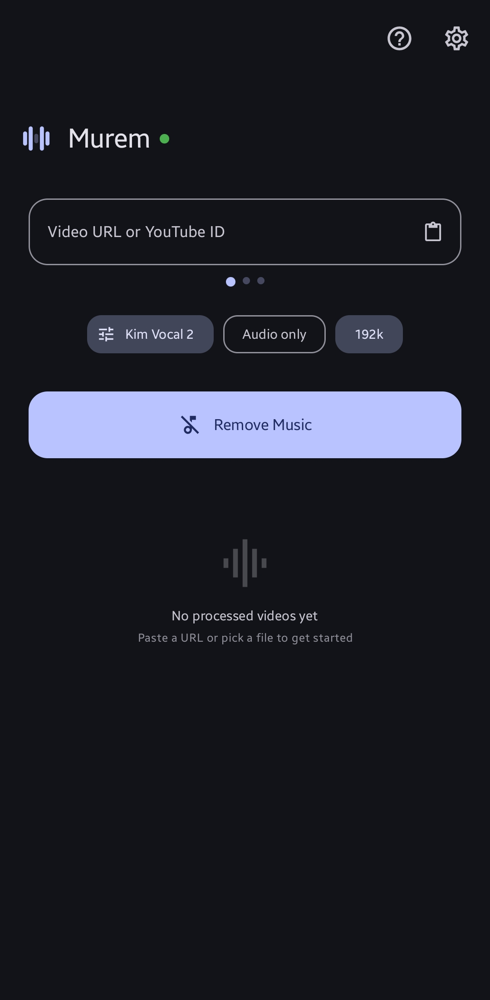
  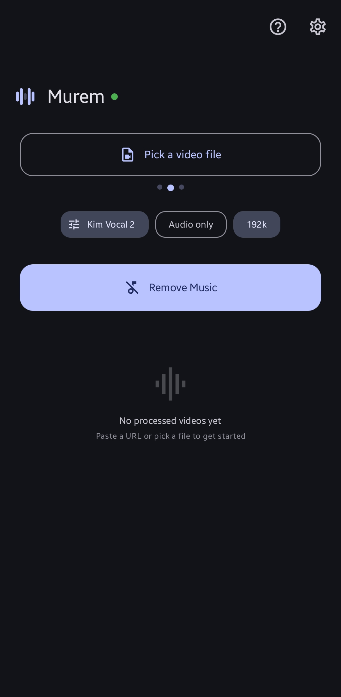
  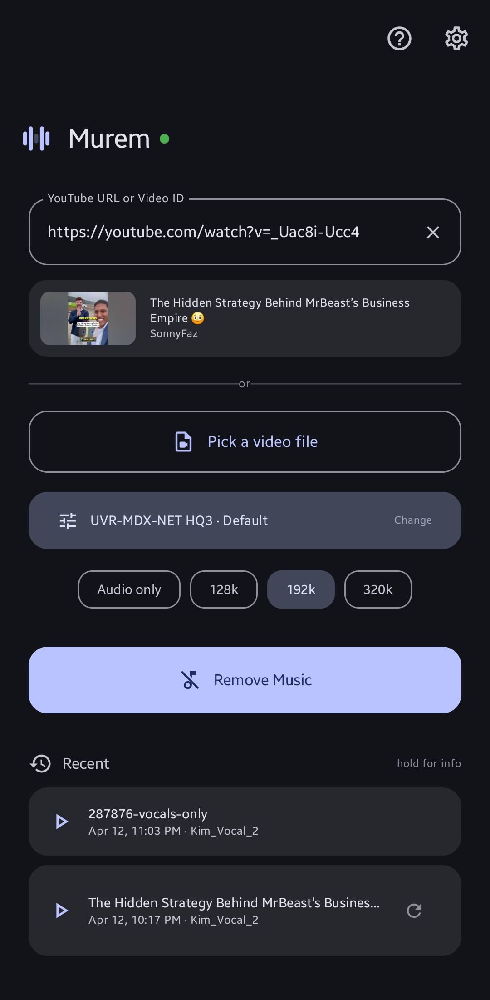
  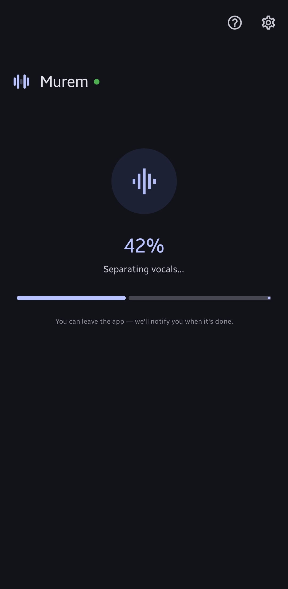
</p>
<p align="center">
  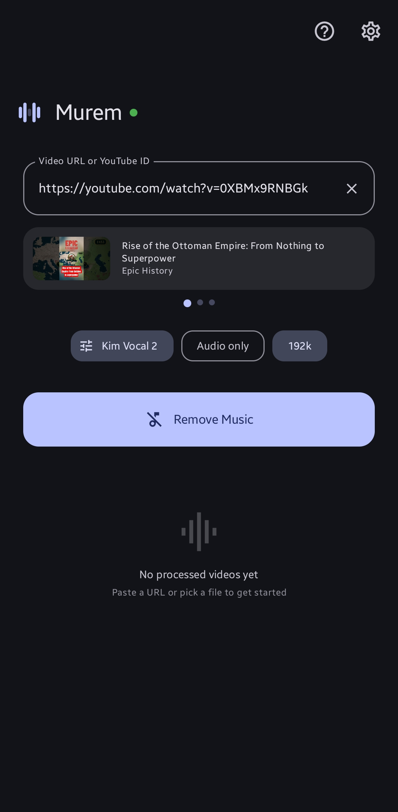
  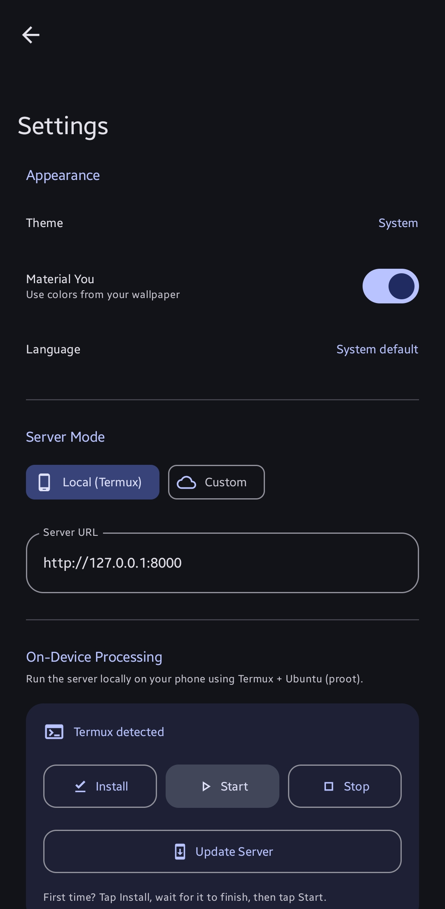
  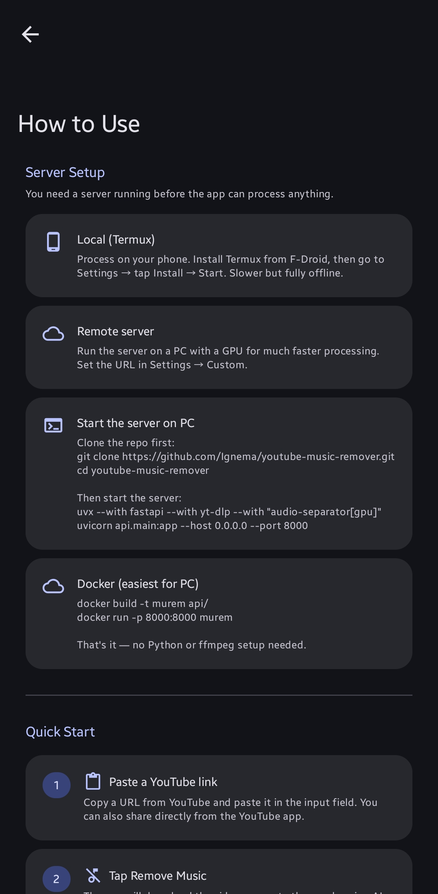
  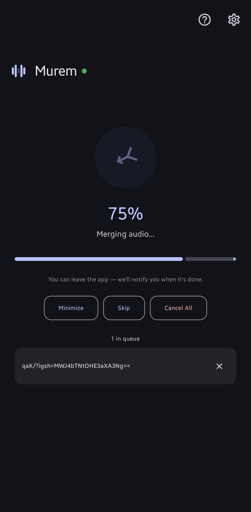
</p>
<p align="center">
  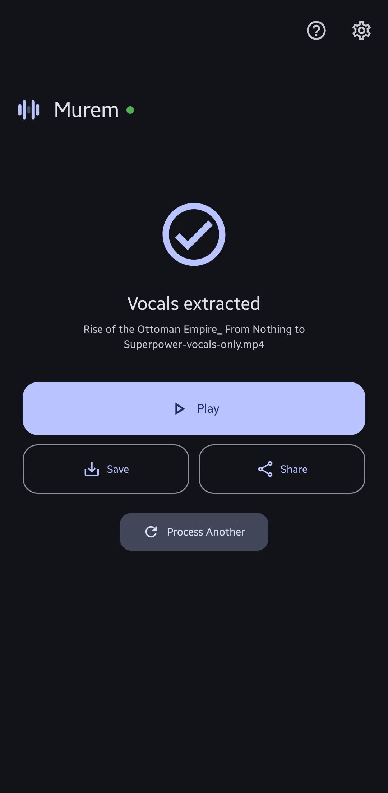
  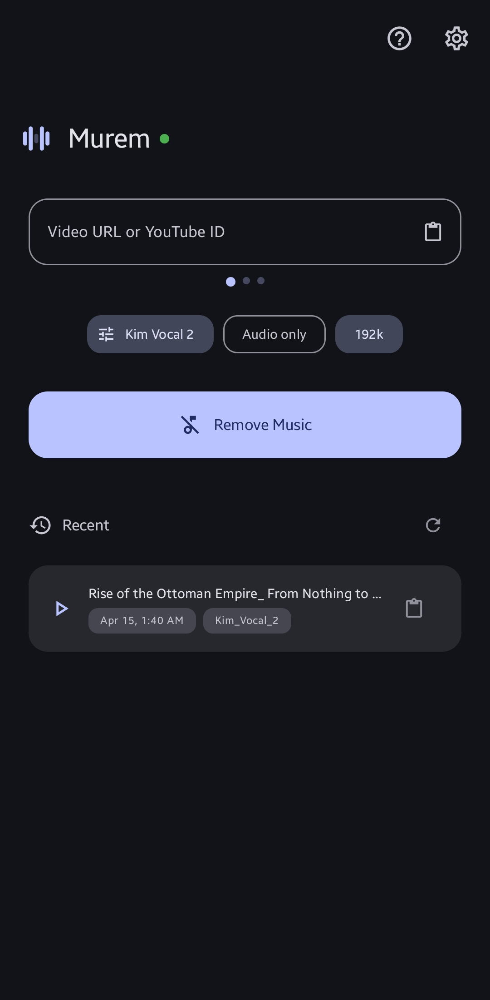
  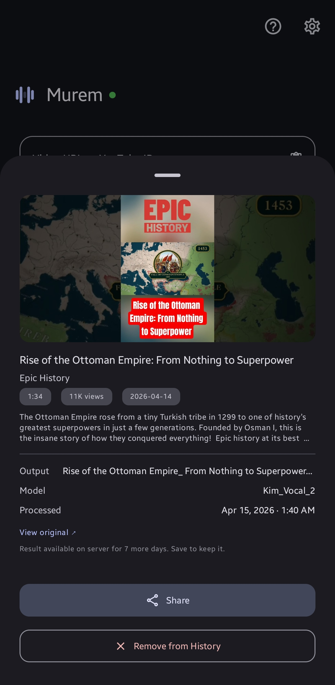
  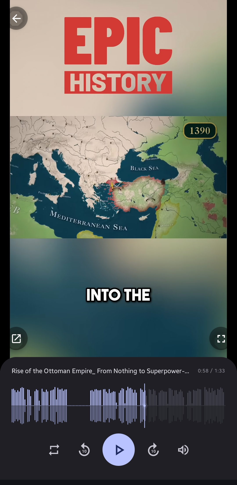
</p>
<p align="center">
  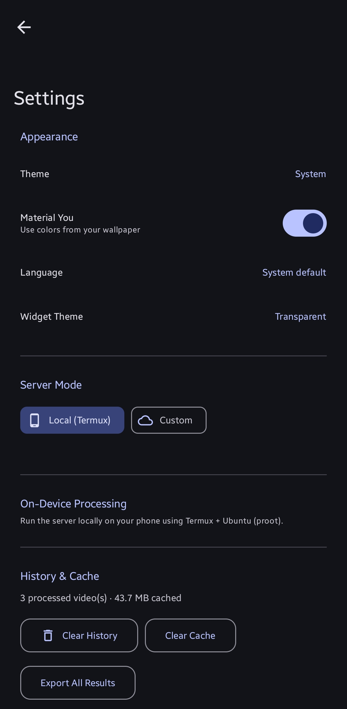
  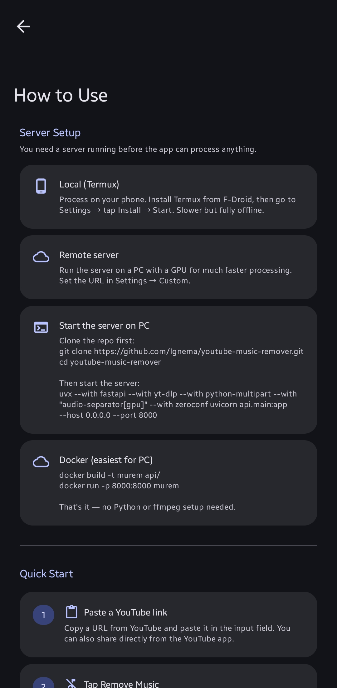
  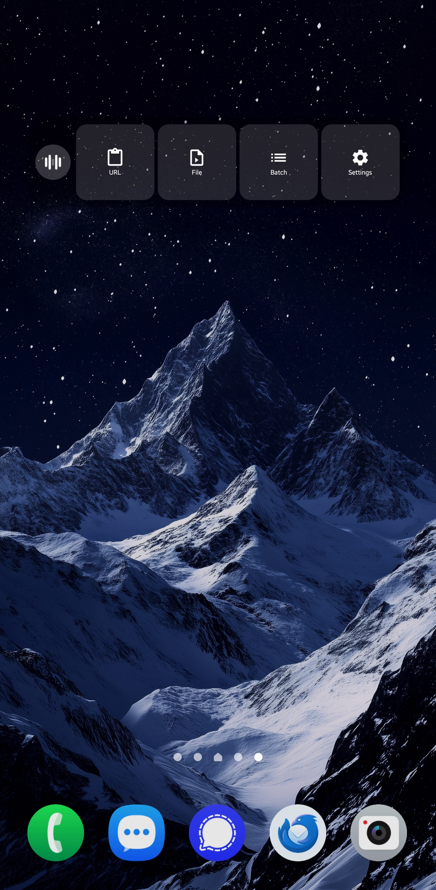
</p>

### Quick Start (Remote Server)

1. Install the APK on your phone
2. On your PC, clone and start the server:
```bash
git clone https://github.com/Ignema/youtube-music-remover.git
cd youtube-music-remover
uvx --with fastapi --with yt-dlp --with python-multipart --with "audio-separator[gpu]" --with zeroconf uvicorn api.main:app --host 0.0.0.0 --port 8000
```

3. In the app, go to Settings → Custom → tap "Auto-discover on network" (or enter your PC's IP)
4. Paste a video link and tap Remove Music

### Quick Start (On-Device with Termux)

1. Install [Termux from F-Droid](https://f-droid.org/packages/com.termux/)
2. In Termux, enable external apps: edit `~/.termux/termux.properties` and set `allow-external-apps = true`
3. In the Murem app, go to Settings → Permissions → grant all
4. Settings → Termux Controls → tap Install (wait for it to finish in Termux)
5. Tap Start → the server starts in the background
6. Go home and process videos

### Docker (Easiest for PC)

```bash
cd api
docker build -t murem .
docker run -p 8000:8000 murem
```

## Notebook / Web UI

### Requirements

- Python 3.8+
- FFmpeg
- CUDA GPU (optional, speeds up processing)

### Installation

```bash
git clone https://github.com/Ignema/youtube-music-remover.git
cd youtube-music-remover
uv venv && uv pip install -e .
```

Install FFmpeg: `winget install ffmpeg` (Windows) / `sudo apt install ffmpeg` (Linux) / `brew install ffmpeg` (Mac)

### Usage

**Notebook:**
```bash
jupyter notebook vocals.ipynb
```

**Web UI (Gradio):**
```bash
python app.py
```

**API Server:**
```bash
uvicorn api.main:app --host 0.0.0.0 --port 8000
```

## API Endpoints

| Method | Path | Description |
|--------|------|-------------|
| GET | `/health` | Health check (includes GPU status) |
| GET | `/api/models` | List available models and bitrates |
| GET | `/api/info?url=` | Get video metadata (any yt-dlp URL) |
| POST | `/api/process` | Start processing a URL |
| POST | `/api/upload` | Upload and process a local file |
| POST | `/api/batch` | Queue multiple URLs |
| GET | `/api/status/{job_id}` | Get job status, progress, and metadata |
| POST | `/api/cancel/{job_id}` | Cancel a running job |
| GET | `/api/download/{job_id}` | Download the result |
| GET | `/api/waveform/{job_id}` | Get pre-computed waveform data |
| WS | `/ws/{job_id}` | WebSocket for real-time progress |

## Available Models

| Model | Type | Description |
|-------|------|-------------|
| `Kim_Vocal_2.onnx` | MDX-Net | Default. Best MDX-Net quality |
| `UVR-MDX-NET-Inst_HQ_3.onnx` | MDX-Net | Fast and lightweight |
| `UVR_MDXNET_KARA_2.onnx` | MDX-Net | Karaoke-style separation |
| `vocals_mel_band_roformer.ckpt` | Roformer | State-of-the-art. GPU recommended |
| `model_bs_roformer_ep_317_sdr_12.9755.ckpt` | Roformer | Premium quality |
| Any `audio-separator` model | Various | Custom model support |

## License

MIT License. See [LICENSE](LICENSE) for details.

## Disclaimer

This tool is for educational and personal use only. You are responsible for complying with the terms of service of video platforms, copyright laws, and obtaining necessary permissions before processing content you don't own.
